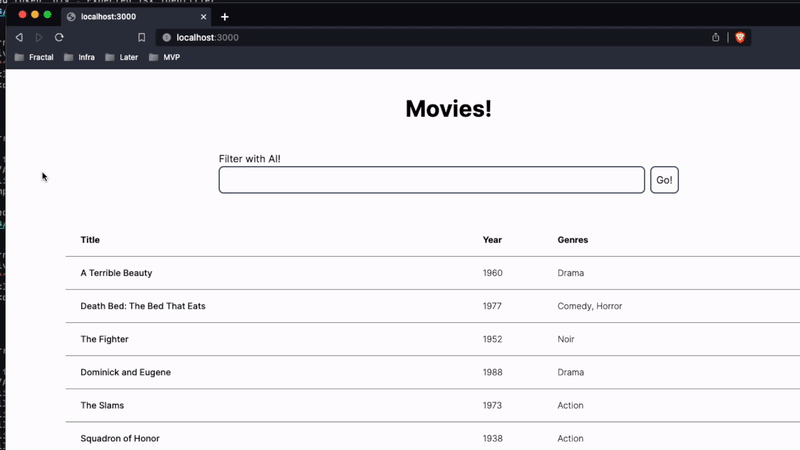

# Deliverable Interview Takehome

### Overview

- Clone this repository
- Implement your solution
- Email tim@mydeliverable.com with a link to your repository
- A short debrief call to discuss your solution will be scheduled if applicable

# Problem

Using the provided Next.js project, implement the following simple fullstack application:

- An index page that lists all the movies in `/json/movies.json` (assume this is your database)
- A movie details page that displays some information about the selected movie
- An "AI-powered" search that takes a natural language query and translates it to a set of filters to narrow down the results shown in the table.

Creating these three features will require implementing a simple React UI, as well as implementing the APIs that will power them.

For the AI search, you have been given the [TypeChat](https://microsoft.github.io/TypeChat/) library. The accompanying documentation and [examples](https://microsoft.github.io/TypeChat/docs/examples/) on their GitHub should give you clear direction. You are also provided the Typscript interface for the filters in the `/types` directory. _Being able to describe at a high-level what TypeChat is doing, and how the type files are being used, is important!_

TypeChat requires an OpenAI API key - if you do not have one, reach out to tim@mydeliverable.com to get one for free. This should be set in your `.env.local` file

The rest is a choose-your-own-adventure. Use technologies you are comfortable with. This is _very_ close to the stack we will be building with at Deliverable.

- Use whatever UI library you want, or just use vanilla Tailwind.
- Fetch the data how you want. We like react-query, but it's up to you.

### Example Demo

### Other notes

- You shouldn't have to modify the type files at all
- `translator.translate()` should be the only API you need to call from TypeChat
- Some API routes are scaffolded out, but you will probably need to create more for your solution
- Move files, delete files, or leave it the same - structure things in a way that works for you! The unimplemented functions are merely a suggestion
